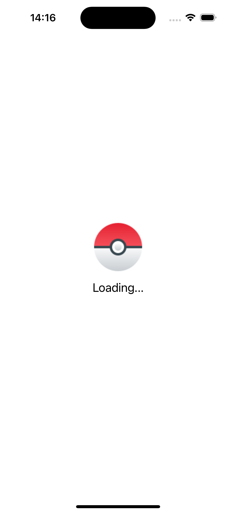
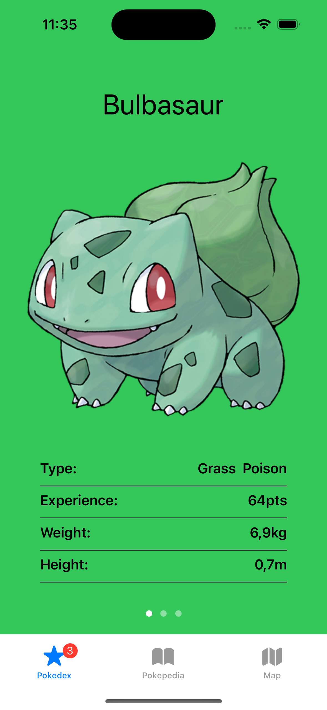
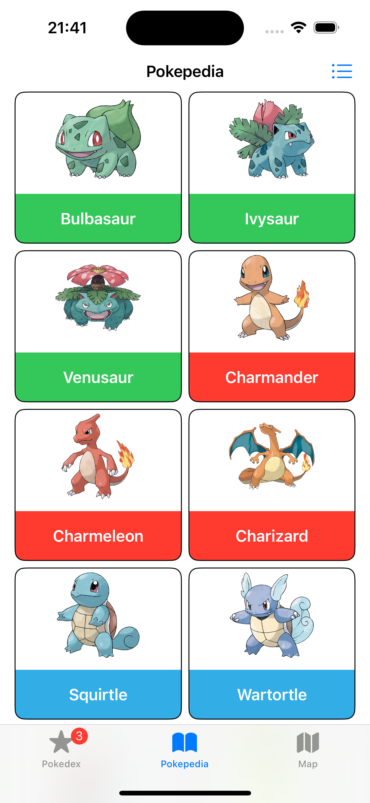
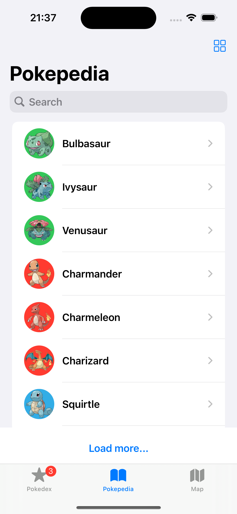
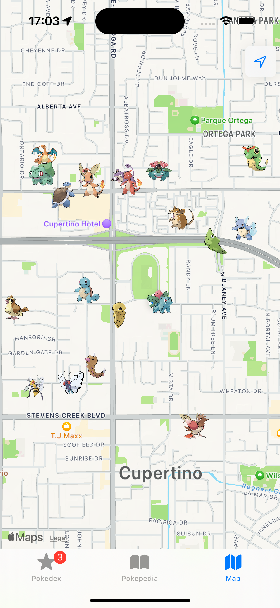
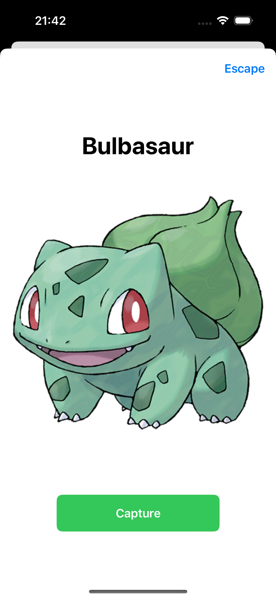

# iPokedex

iPokedex is the application I have developed for my Final Degree Project. It uses the PokeAPI to show pokemons in different screens and and allows the user to "interact" with them.

## PokeAPI

#### Get one itemm

```
  GET https://pokeapi.co/api/v2/pokemon/{id or name}/
```

| Parameter | Type     | Description                       |
| :-------- | :------- | :-------------------------------- |
| `id`      | `Int`    | Id of the pokemon                 |
| `name`    | `String` | Name of the pokemon               |
|

#### `func parsePokemonJSON(_ data: Data) async -> Pokemon?`

Decodes `JSON` data into a `Pokemon` object. Returns `nil` id any errors arise.

#### `getPokemon(_ pokemonURL: String, session: URLSession = URLSession.shared) async -> Pokemon?`

Retrieves pokemon data from a given URL, handles potential errors gracefully, and returns a `Pokemon` object if successful, or `nil` if any issues arise.

#### `func getPokemons() async -> [Pokemon]`

Retrieves an array of `n` (20 by default) `Pokemons`.
## Features

- Two different lists. Captured pokemons and all existing pokemons.
- Search
- Pagination
- Maps: tracking user location


## Installation

1. Open your terminal
2. Clone the project: `git clone https://Erikote04/iPokedex.git`
3. Open the project on Xcode
4. Run the app: `CMD + R`

## Screen

<p float="left">
  

  

  

  

  

  
</p>

## Running Tests

To run tests: `CMD + U`
